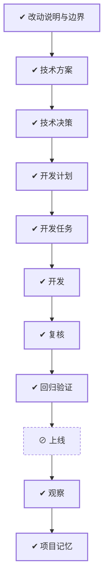

# WORK-001：重建统一开发文档系统

## 流程

<!-- 本节由 `scripts/work` 生成，请勿手工编辑；改动请运行 refresh。 -->

| 阶段 | 状态 | 必需性 | 依据文档 | 说明 |
|---|---|---|---|---|
| 改动说明与边界 | ✔ 完成 | 必需 | CHANGE-001 `approved` | 说清楚这件事要达成什么、边界在哪、怎样算完成 |
| 技术方案 | ✔ 完成 | 必需 | DESIGN-001 `approved` | 确定技术方案、边界与取舍 |
| 技术决策 | ✔ 完成 | 必需 | DECISION-001 `approved` |  |
| 开发计划 | ✔ 完成 | 必需 | PLAN-001 `approved` | 拆成阶段与顺序，说明并行、依赖、迁移与回退 |
| 开发任务 | ✔ 完成 | 必需 | TASK-001 `verified` | 拆成可独立完成并验证的任务，划定可读、可写与禁止范围 |
| 开发 | ✔ 完成 | 必需 | TASK-001 `verified` | 按任务实施，产出代码与测试 |
| 复核 | ✔ 完成 | 必需 | — | 独立复核实现是否符合定义与方案，边界有没有被越过 |
| 回归验证 | ✔ 完成 | 必需 | VERIFY-001 `approved` | 用可复现的证据确认要求逐条满足 |
| 上线 | ⊘ 跳过（手动） | 可选 | — | 把成果交付出去 |
| 观察 | ✔ 完成（手动） | 必需 | — | 交付后观察实际结果，确认没有引入新问题 |
| 项目记忆 | ✔ 完成 | 必需 | MEMORY-001 `approved` | 留下未来仍有参考价值的判断、教训与重审条件 |

## 待确认项

暂无。

## 变更记录

- 2026-08-24：创建工作项并生成初始流程。
- 2026-08-24：完成统一工具、模板、迁移、规则与 CI 重构。
- 2026-08-24：根据文档、任务与验证事实刷新状态：todo → verified。
- 2026-08-24：根据 WORK Type、风险、影响面和关注项重建流程。
- 2026-08-24：根据 WORK Type、风险、影响面和关注项重建流程。
- 2026-08-24：根据 WORK Type、风险、影响面和关注项重建流程。
- 2026-08-24：根据 WORK Type、风险、影响面和关注项重建流程。
- 2026-08-24：流程阶段 上线：ready → skipped。原因：纯仓库文档系统改造，无业务服务上线
- 2026-08-24：流程阶段 观察：pending → ready。原因：既有验证证据满足可靠性观察前置条件
- 2026-08-24：流程阶段 观察：ready → doing。原因：检查迁移后创建、校验和 CI 入口运行情况
- 2026-08-24：流程阶段 观察：doing → done。原因：后续两次文档系统重构均通过存量回归
- 2026-09-01：正文收敛为控制面入口，「为什么做、成功标准、当前流程、风险点、影响面、关联文档」不再在此重复；产品面内容以定义层文档为准。
