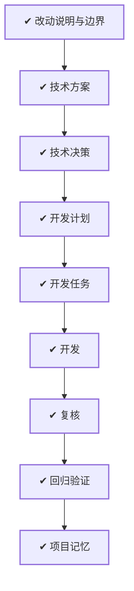

# WORK-007：校正全局 PRD 与当前 MVP 基线的漂移

## 流程

<!-- 本节由 `scripts/work` 生成，请勿手工编辑；改动请运行 refresh。 -->

| 阶段 | 状态 | 必需性 | 依据文档 | 说明 |
|---|---|---|---|---|
| 改动说明与边界 | ✔ 完成 | 必需 | CHANGE-005 `approved` | 说清楚这件事要达成什么、边界在哪、怎样算完成 |
| 技术方案 | ✔ 完成 | 必需 | DESIGN-005 `approved` | 确定技术方案、边界与取舍 |
| 技术决策 | ✔ 完成 | 必需 | DECISION-005 `approved` |  |
| 开发计划 | ✔ 完成 | 必需 | PLAN-005 `approved` | 拆成阶段与顺序，说明并行、依赖、迁移与回退 |
| 开发任务 | ✔ 完成 | 必需 | TASK-007 `done` | 拆成可独立完成并验证的任务，划定可读、可写与禁止范围 |
| 开发 | ✔ 完成 | 必需 | TASK-007 `done` | 按任务实施，产出代码与测试 |
| 复核 | ✔ 完成 | 必需 | — | 独立复核实现是否符合定义与方案，边界有没有被越过 |
| 回归验证 | ✔ 完成 | 必需 | VERIFY-007 `approved` | 用可复现的证据确认要求逐条满足 |
| 项目记忆 | ✔ 完成 | 必需 | MEMORY-005 `approved` | 留下未来仍有参考价值的判断、教训与重审条件 |

## 待确认项

暂无。

## 变更记录

- 2026-08-25：创建工作项并生成初始流程。
- 2026-08-25：完成 PRD、架构、数据模型、contracts v2 与 WORK-002 的漂移审计。
- 2026-08-25：按稳定产品合同重写 PRD，并完成跨文档、范围、链接和漂移关键词检查。
- 2026-08-25：流程阶段 复核：ready → doing。原因：开始核对 PRD 不变量、WORK-002 未决边界、技术真源兼容性和修改范围
- 2026-08-25：流程阶段 复核：doing → done。原因：确认重写保留产品定位和九项不变量，未代签 WORK-002，未修改代码、契约或技术真源
- 2026-08-25：根据文档、任务与验证事实刷新状态：todo → verified。
- 2026-08-25：流程阶段 上线：ready → skipped。原因：纯全局 PRD 文档校正，无运行时发布、数据迁移或部署动作
- 2026-08-25：流程阶段 观察：pending → skipped。原因：无线上行为变化，观察由跨文档核对、链接检查和开发文档回归完成
- 2026-09-01：正文收敛为控制面入口，「为什么做、成功标准、当前流程、风险点、影响面、关联文档」不再在此重复；产品面内容以定义层文档为准。
- 2026-09-01：移除流程阶段：release、observe。MVP 阶段没有生产环境，这两个阶段永远无法完成。
