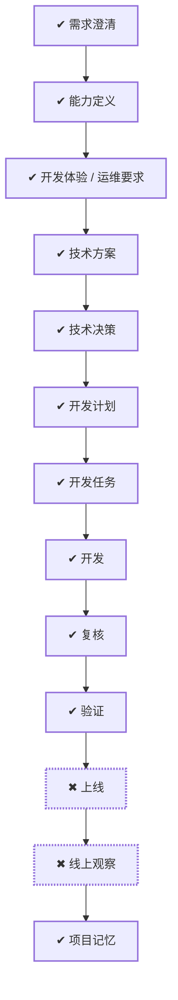

# WORK-010：建立跨语言可观测性基础设施

> 历史记录：本工作交付的运行时实现已由 WORK-012 整体撤回；除 traceId/requestId 追溯契约外，本文
> 不再代表当前仓库能力或有效实施基线。

## 流程

<!-- 本节由 `scripts/work` 生成，请勿手工编辑；改动请运行 refresh。 -->

| 阶段 | 状态 | 必需性 | 依据文档 | 说明 |
|---|---|---|---|---|
| 需求澄清 | ✔ 完成 | 必需 | WORK-010 `verified` | 把还没想清楚的问题问出来并得到答复，否则不开工 |
| 能力定义 | ✔ 完成 | 必需 | CAPABILITY-003 `approved` | 说清楚这件事要达成什么、边界在哪、怎样算完成 |
| 开发体验 / 运维要求 | ✔ 完成 | 必需 | EXPERIENCE-004 `approved` | 设计使用者实际看到和操作的流程，包含异常与失败状态 |
| 技术方案 | ✔ 完成 | 必需 | DESIGN-008 `approved` | 确定技术方案、边界与取舍 |
| 技术决策 | ✔ 完成 | 必需 | DECISION-007 `approved` |  |
| 开发计划 | ✔ 完成 | 必需 | PLAN-008 `approved` | 拆成阶段与顺序，说明并行、依赖、迁移与回退 |
| 开发任务 | ✔ 完成 | 必需 | TASK-010 `done`、TASK-011 `done`、TASK-012 `done`、TASK-013 `done` | 拆成可独立完成并验证的任务，划定可读、可写与禁止范围 |
| 开发 | ✔ 完成 | 必需 | TASK-010 `done`、TASK-011 `done`、TASK-012 `done`、TASK-013 `done` | 按任务实施，产出代码与测试 |
| 复核 | ✔ 完成 | 必需 | — | 独立复核实现是否符合定义与方案，边界有没有被越过 |
| 验证 | ✔ 完成 | 必需 | VERIFY-010 `approved` | 用可复现的证据确认要求逐条满足 |
| 上线 | ✖ 受阻（手动） | 必需 | — | 把成果交付出去 |
| 线上观察 | ✖ 受阻（手动） | 必需 | — | 交付后观察实际结果，确认没有引入新问题 |
| 项目记忆 | ✔ 完成 | 必需 | MEMORY-008 `approved` | 留下未来仍有参考价值的判断、教训与重审条件 |

## 待确认项

暂无。DECISION-007 的方案 A 与五项边界已于 2026-08-26 获负责人确认。

## 变更记录

- 2026-08-25：创建工作项并生成初始流程。
- 2026-08-26：负责人确认 DECISION-007 方案 A 与全部五项边界，授权按 PLAN-008 开始实施。
- 2026-08-26：根据文档、任务与验证事实刷新状态：todo → doing。
- 2026-08-26：流程阶段 复核：ready → doing。原因：开始独立复核跨模块影响、安全脱敏、基数、Context 传播、资源边界与任务路径
- 2026-08-26：流程阶段 复核：doing → done。原因：影响、安全、基数、传播、资源、路径与回退复核完成；未发现未解决缺陷或越界改动
- 2026-08-26：VERIFY-010 通过契约、Java、Go、Compose、Alloy/Grafana、默认容器与 host fallback
  跨运行时验证；五项成功标准均有可执行证据。
- 2026-08-26：流程阶段 上线：pending → blocked。原因：当前工作只授权仓库实现与本地 reference stack，没有生产部署目标、凭据、容量/SLO 或发布授权
- 2026-08-26：流程阶段 线上观察：pending → blocked。原因：生产发布尚未发生，无法进行线上负载、成本、留存和告警观察；本地停采/恢复已由 VERIFY-010 覆盖
- 2026-08-26：根据文档、任务与验证事实刷新状态：doing → verified。
- 2026-09-01：正文收敛为控制面入口，「为什么做、成功标准、当前流程、风险点、影响面、关联文档」不再在此重复；产品面内容以定义层文档为准。
