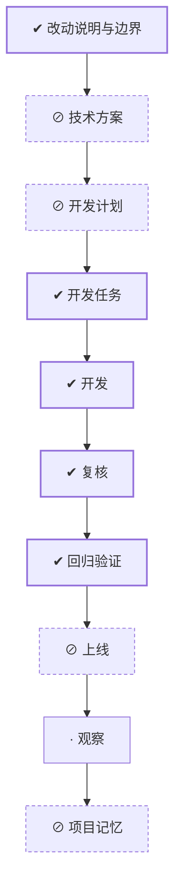

# WORK-011：收敛 Go 领域日志调用

> 历史记录：本重构随 WORK-012 的观测实现整体回退，不再存在于当前代码。

## 流程

<!-- 本节由 `scripts/work` 生成，请勿手工编辑；改动请运行 refresh。 -->

| 阶段 | 状态 | 必需性 | 依据文档 | 说明 |
|---|---|---|---|---|
| 改动说明与边界 | ✔ 完成 | 必需 | CHANGE-006 `approved` | 说清楚这件事要达成什么、边界在哪、怎样算完成 |
| 技术方案 | ⊘ 跳过 | 可选 | — | 确定技术方案、边界与取舍 |
| 开发计划 | ⊘ 跳过 | 可选 | — | 拆成阶段与顺序，说明并行、依赖、迁移与回退 |
| 开发任务 | ✔ 完成 | 必需 | TASK-014 `done` | 拆成可独立完成并验证的任务，划定可读、可写与禁止范围 |
| 开发 | ✔ 完成 | 必需 | TASK-014 `done` | 按任务实施，产出代码与测试 |
| 复核 | ✔ 完成 | 必需 | — | 独立复核实现是否符合定义与方案，边界有没有被越过 |
| 回归验证 | ✔ 完成 | 必需 | VERIFY-011 `approved` | 用可复现的证据确认要求逐条满足 |
| 上线 | ⊘ 跳过（手动） | 可选 | — | 把成果交付出去 |
| 观察 | · 未开始 | 必需 | — | 交付后观察实际结果，确认没有引入新问题 |
| 项目记忆 | ⊘ 跳过 | 可选 | — | 留下未来仍有参考价值的判断、教训与重审条件 |

## 待确认项

暂无。

## 变更记录

- 2026-08-26：创建工作项并生成初始流程。
- 2026-08-26：按负责人反馈明确只收敛 Go 领域日志调用，Metrics/Trace 语义与外部行为保持不变。
- 2026-08-26：根据文档、任务与验证事实刷新状态：todo → doing。
- 2026-08-26：完成具名 EventLogger 适配器、业务单行调用和真实容器采集回归，未改变日志 schema 或
  其他遥测/业务行为。
- 2026-08-26：根据文档、任务与验证事实刷新状态：doing → implemented。
- 2026-08-26：流程阶段 复核：ready → done。原因：复核确认业务包不再直接拼日志字段，消费方接口可空安全，EventLogger 只读取 allowlist，Metrics/Trace 与外部行为未变
- 2026-08-26：根据文档、任务与验证事实刷新状态：implemented → verified。
- 2026-08-26：流程阶段 上线：ready → skipped。原因：纯内部日志重构不需要独立发布动作，变更随当前未提交工作统一交付
- 2026-09-01：正文收敛为控制面入口，「为什么做、成功标准、当前流程、风险点、影响面、关联文档」不再在此重复；产品面内容以定义层文档为准。
