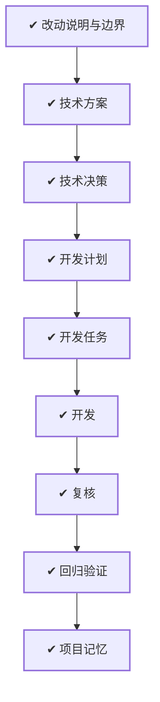

# WORK-012：撤回可观测性实现并保留追溯契约

## 流程

<!-- 本节由 `scripts/work` 生成，请勿手工编辑；改动请运行 refresh。 -->

| 阶段 | 状态 | 必需性 | 依据文档 | 说明 |
|---|---|---|---|---|
| 改动说明与边界 | ✔ 完成 | 必需 | CHANGE-007 `approved` | 说清楚这件事要达成什么、边界在哪、怎样算完成 |
| 技术方案 | ✔ 完成 | 必需 | DESIGN-009 `approved` | 确定技术方案、边界与取舍 |
| 技术决策 | ✔ 完成 | 必需 | DECISION-008 `approved` |  |
| 开发计划 | ✔ 完成 | 必需 | PLAN-009 `approved` | 拆成阶段与顺序，说明并行、依赖、迁移与回退 |
| 开发任务 | ✔ 完成 | 必需 | TASK-015 `done` | 拆成可独立完成并验证的任务，划定可读、可写与禁止范围 |
| 开发 | ✔ 完成 | 必需 | TASK-015 `done` | 按任务实施，产出代码与测试 |
| 复核 | ✔ 完成 | 必需 | — | 独立复核实现是否符合定义与方案，边界有没有被越过 |
| 回归验证 | ✔ 完成 | 必需 | VERIFY-012 `approved` | 用可复现的证据确认要求逐条满足 |
| 项目记忆 | ✔ 完成 | 必需 | MEMORY-009 `approved` | 留下未来仍有参考价值的判断、教训与重审条件 |

## 待确认项

暂无。

## 变更记录

- 2026-08-26：创建工作项并生成初始流程。
- 2026-08-26：负责人要求撤回本次全部观测系统代码和设计，只保留 traceId/requestId 追溯设计。
- 2026-08-26：根据文档、任务与验证事实刷新状态：todo → doing。
- 2026-08-26：运行时观测实现和本地采集栈已撤回，追溯契约保留；Java、Go、contracts、Compose 与
  本地容器回归通过。
- 2026-08-26：根据文档、任务与验证事实刷新状态：doing → implemented。
- 2026-08-26：流程阶段 复核：ready → done。原因：已完成允许范围、残留观测代码与追溯契约保留项复核
- 2026-08-26：根据文档、任务与验证事实刷新状态：implemented → verified。
- 2026-08-26：流程阶段 上线：ready → skipped。原因：本次仅回退未提交的本地实现，不执行生产发布
- 2026-08-26：流程阶段 观察：pending → ready。原因：本地运行观察窗口已具备，业务容器已使用回退镜像重建
- 2026-08-26：流程阶段 观察：ready → done。原因：judge/sandbox 健康，Compose 中无观测容器，回退后的运行状态符合预期
- 2026-09-01：正文收敛为控制面入口，「为什么做、成功标准、当前流程、风险点、影响面、关联文档」不再在此重复；产品面内容以定义层文档为准。
- 2026-09-01：移除流程阶段：release、observe。MVP 阶段没有生产环境，这两个阶段永远无法完成。
