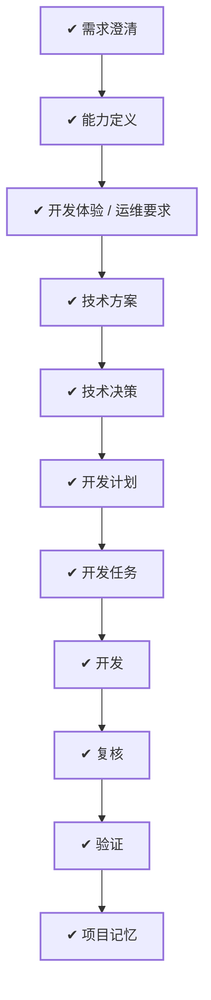

# WORK-013：建立用户身份与访问控制服务

## 流程

<!-- 本节由 `scripts/work` 生成，请勿手工编辑；改动请运行 refresh。 -->

| 阶段 | 状态 | 必需性 | 依据文档 | 说明 |
|---|---|---|---|---|
| 需求澄清 | ✔ 完成 | 必需 | WORK-013 `todo` | 把还没想清楚的问题问出来并得到答复，否则不开工 |
| 能力定义 | ✔ 完成 | 必需 | CAPABILITY-004 `approved` | 说清楚这件事要达成什么、边界在哪、怎样算完成 |
| 开发体验 / 运维要求 | ✔ 完成 | 必需 | EXPERIENCE-005 `approved` | 设计使用者实际看到和操作的流程，包含异常与失败状态 |
| 技术方案 | ✔ 完成 | 必需 | DESIGN-010 `approved` | 确定技术方案、边界与取舍 |
| 技术决策 | ✔ 完成 | 必需 | DECISION-009 `approved` |  |
| 开发计划 | ✔ 完成 | 必需 | PLAN-010 `approved` | 拆成阶段与顺序，说明并行、依赖、迁移与回退 |
| 开发任务 | ✔ 完成 | 必需 | TASK-016 `done`、TASK-017 `done`、TASK-018 `done`、TASK-019 `done` | 拆成可独立完成并验证的任务，划定可读、可写与禁止范围 |
| 开发 | ✔ 完成 | 必需 | TASK-016 `done`、TASK-017 `done`、TASK-018 `done`、TASK-019 `done` | 按任务实施，产出代码与测试 |
| 复核 | ✔ 完成 | 必需 | — | 独立复核实现是否符合定义与方案，边界有没有被越过 |
| 验证 | ✔ 完成 | 必需 | VERIFY-013 `approved` | 用可复现的证据确认要求逐条满足 |
| 项目记忆 | ✔ 完成 | 必需 | MEMORY-010 `approved` | 留下未来仍有参考价值的判断、教训与重审条件 |

## 待确认项

暂无。2026-08-26 已确认：MVP 由管理员开通账号；首个 ADMIN 使用一次性离线命令初始化；会话空闲
30 分钟、最长 12 小时并允许多端登录；退出结束当前端，改密、重置、角色变化或封禁结束全部登录。

## 变更记录

- 2026-08-26：创建工作项并生成初始流程。
- 2026-08-26：完成能力、体验、技术方案、候选决策、计划、任务和验证草案；推荐方案等待人工审核，
  未授权实施。
- 2026-08-26：负责人确认 DECISION-009 全部推荐项与安全边界，授权按 PLAN-010 开始实施。
- 2026-08-26：根据 WORK Type、风险、影响面和关注项重建流程。
- 2026-08-26：四个 TASK 完成；独立复核修正失败登录事务、MySQL 锁定阈值、Session 撤销、首次改密
  token、轮换上一公钥、Retry-After 与 Web 恢复/无障碍缺口，聚合回归全部通过。
- 2026-08-26：流程阶段 复核：ready → doing。原因：开始对认证事务、MySQL 阈值、Session 撤销、JWT/JWKS、首次改密门禁和 Web 恢复路径执行独立复核
- 2026-08-26：流程阶段 复核：doing → done。原因：独立复核发现的问题均已修正并新增回归测试，影响面与安全边界已复查
- 2026-08-26：流程阶段 上线：pending → blocked。原因：本次授权范围仅为仓库实施，未提供生产环境、Secret、域名或发布授权
- 2026-08-26：流程阶段 线上观察：pending → blocked。原因：尚未生产发布，无法产生线上可靠性与撤销时延观察证据
- 2026-09-01：正文收敛为控制面入口，「为什么做、成功标准、当前流程、风险点、影响面、关联文档」不再在此重复；产品面内容以定义层文档为准。
- 2026-09-01：移除流程阶段：release、observe。MVP 阶段没有生产环境，这两个阶段永远无法完成。
