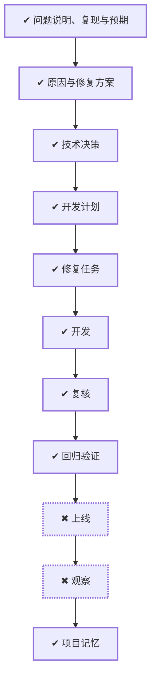

# WORK-014：统一登录空闲过期配置并修复提前掉线

<!--
本文件面向产品经理和不需要了解实现细节的读者。能用日常语言说清楚时不要使用专业词；必须使用时，
第一次出现就解释它对使用者意味着什么。字段、类、框架、协议、表名、路径和命令放到 DESIGN、PLAN
或 TASK。这里优先说明为什么做、完成后有什么变化、怎样算成功和可能影响谁。
-->

## 流程

<!-- 本节由 `scripts/work` 生成，请勿手工编辑；改动请运行 refresh。 -->

| 阶段 | 状态 | 必需性 | 依据文档 | 说明 |
|---|---|---|---|---|
| 问题说明、复现与预期 | ✔ 完成 | 必需 | ISSUE-002 `approved` | 说清楚这件事要达成什么、边界在哪、怎样算完成 |
| 原因与修复方案 | ✔ 完成 | 必需 | DESIGN-011 `approved` | 确定技术方案、边界与取舍 |
| 技术决策 | ✔ 完成 | 必需 | DECISION-010 `approved` |  |
| 开发计划 | ✔ 完成 | 必需 | PLAN-011 `approved` | 拆成阶段与顺序，说明并行、依赖、迁移与回退 |
| 修复任务 | ✔ 完成 | 必需 | TASK-020 `done` | 拆成可独立完成并验证的任务，划定可读、可写与禁止范围 |
| 开发 | ✔ 完成 | 必需 | TASK-020 `done` | 按任务实施，产出代码与测试 |
| 复核 | ✔ 完成 | 必需 | — | 独立复核实现是否符合定义与方案，边界有没有被越过 |
| 回归验证 | ✔ 完成 | 必需 | VERIFY-014 `approved` | 用可复现的证据确认要求逐条满足 |
| 上线 | ✖ 受阻（手动） | 必需 | — | 把成果交付出去 |
| 观察 | ✖ 受阻（手动） | 必需 | — | 交付后观察实际结果，确认没有引入新问题 |
| 项目记忆 | ✔ 完成 | 必需 | MEMORY-011 `approved` | 留下未来仍有参考价值的判断、教训与重审条件 |

## 待确认项

2026-08-27 负责人已明确要求时间单位统一为秒，并增加 IDLE 刷新布尔开关。推荐默认值与合法范围为：

- `CHERRY_AUTH_SESSION_IDLE_TIMEOUT_SECONDS=1800`，范围 300～7200 秒；
- `CHERRY_AUTH_SESSION_ABSOLUTE_TIMEOUT_SECONDS=43200`，范围 3600～604800 秒；
- `CHERRY_AUTH_SESSION_REFRESH_IDLE_ON_ACTIVITY=true`，只接受 `true | false`。

2026-08-27 负责人已确认 DESIGN-011、DECISION-010、PLAN-011，并明确允许实施；仓库内实现与验证完成。
生产发布、两个进程的变量注入和线上到期观察仍需目标环境授权。

## 变更记录

- 2026-08-27：创建工作项并生成初始流程。
- 2026-08-27：确认当前默认空闲期限为 30 分钟、绝对期限为 12 小时、内部 JWT 为 120 秒；发现
  Gateway 注解硬编码与 user-service 配置分散，形成统一配置修复草案，等待审核。
- 2026-08-27：根据审核反馈把 IDLE 与绝对期限配置单位改为秒，并增加“认证 API 操作是否刷新 IDLE”
  布尔配置；默认值建议保持现有 1800/43200 秒和刷新开启。
- 2026-08-27：完成 Gateway 与 user-service 双层实现、配置一致性 fail-closed、真实 Redis/MySQL 回归及
  Java 聚合验证；仓库内成功标准全部满足，生产发布与观察保留为阻塞阶段。
- 2026-08-27：负责人明确“确认方案，开始实施”，记录完成安全边界与权限影响的人工确认；该确认不
  包含生产发布或线上观察授权。
- 2026-08-27：流程阶段 复核：ready → doing。原因：开始对会话截止时间、配置一致性、内部接口权限与 TASK 路径边界执行实现后复核
- 2026-08-27：流程阶段 复核：doing → done。原因：复核确认 IDLE 等号失效、绝对期限封顶、JWT 透明刷新、503 保留 Session、安全白名单与范围边界均有测试证据
- 2026-08-27：流程阶段 上线：pending → blocked。原因：未提供生产环境、Secret、配置中心或发布授权，本次仅完成仓库实现
- 2026-08-27：流程阶段 观察：pending → blocked。原因：尚未生产发布，无法取得真实用户登录期限与可靠性观察证据
- 2026-09-01：正文收敛为控制面入口，「为什么做、成功标准、当前流程、风险点、影响面、关联文档」不再在此重复；产品面内容以定义层文档为准。
