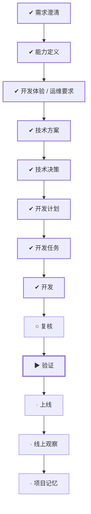

# WORK-015：建立 Cherry OJ Web 设计系统

## 流程

<!-- 本节由 `scripts/work` 生成，请勿手工编辑；改动请运行 refresh。 -->

| 阶段 | 状态 | 必需性 | 依据文档 | 说明 |
|---|---|---|---|---|
| 需求澄清 | ✔ 完成 | 必需 | WORK-015 `implemented` | 把还没想清楚的问题问出来并得到答复，否则不开工 |
| 能力定义 | ✔ 完成 | 必需 | CAPABILITY-005 `approved` | 说清楚这件事要达成什么、边界在哪、怎样算完成 |
| 开发体验 / 运维要求 | ✔ 完成 | 必需 | EXPERIENCE-006 `approved` | 设计使用者实际看到和操作的流程，包含异常与失败状态 |
| 技术方案 | ✔ 完成 | 必需 | DESIGN-012 `approved` | 确定技术方案、边界与取舍 |
| 技术决策 | ✔ 完成 | 必需 | DECISION-011 `approved` |  |
| 开发计划 | ✔ 完成 | 必需 | PLAN-012 `approved` | 拆成阶段与顺序，说明并行、依赖、迁移与回退 |
| 开发任务 | ✔ 完成 | 必需 | TASK-021 `done` | 拆成可独立完成并验证的任务，划定可读、可写与禁止范围 |
| 开发 | ✔ 完成 | 必需 | TASK-021 `done` | 按任务实施，产出代码与测试 |
| 复核 | ○ 就绪 | 必需 | — | 独立复核实现是否符合定义与方案，边界有没有被越过 |
| 验证 | ▶ 进行中 | 必需 | VERIFY-015 `review` | 用可复现的证据确认要求逐条满足 |
| 上线 | · 未开始 | 必需 | — | 把成果交付出去 |
| 线上观察 | · 未开始 | 必需 | — | 交付后观察实际结果，确认没有引入新问题 |
| 项目记忆 | · 未开始 | 必需 | MEMORY-012 `draft` | 留下未来仍有参考价值的判断、教训与重审条件 |

## 待确认项

用户已在 2026-08-27 明确批准 DESIGN-012 的双主题色值、Cherry/danger 分离、selector、manifest、
扩展合同和 docs-only 范围，并明确允许执行 TASK-021。实现现已完成并进入 VERIFY-015 人工复核；
待确认项不是重新决定方案，而是检查实际组件参考后决定是否签署 `approved/pass`。

## 变更记录

- 2026-08-27：创建工作项并生成初始流程。
- 2026-08-27：完成 Linear fixture、Cherry 现有品牌色和 Web 样式的只读对照，形成待人工审核的
  能力、体验、设计、决策、计划、任务和验证草案；尚未修改全局设计文档或运行时代码。
- 2026-08-27：根据 WORK Type、风险、影响面和关注项重建流程。
- 2026-08-27：用户确认 Linear 黑色为默认、增加 pure-white 浅色主题，并要求主题架构支持未来扩展；
  回到方案层补充双主题 token 与主题合同。
- 2026-08-27：根据文档、任务与验证事实刷新状态：todo → doing。
- 2026-08-27：用户批准双主题方案并允许执行；完成 docs 设计系统、全局入口与验证证据，运行时代码
  保持不变，准备将 TASK-021 标记完成并把 VERIFY-015 提交人工复核。
- 2026-08-27：根据文档、任务与验证事实刷新状态：doing → implemented。
- 2026-09-01：正文收敛为控制面入口，「为什么做、成功标准、当前流程、风险点、影响面、关联文档」不再在此重复；产品面内容以定义层文档为准。
