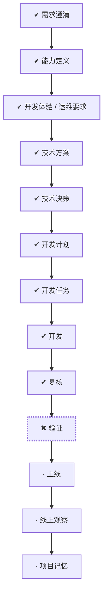

# WORK-017：建立 Web 设计系统代码基建

<!--
本文件面向产品经理和不需要了解实现细节的读者。能用日常语言说清楚时不要使用专业词；必须使用时，
第一次出现就解释它对使用者意味着什么。字段、类、框架、协议、表名、路径和命令放到 DESIGN、PLAN
或 TASK。这里优先说明为什么做、完成后有什么变化、怎样算成功和可能影响谁。
-->

## 流程

<!-- 本节由 `scripts/work` 生成，请勿手工编辑；改动请运行 refresh。 -->

| 阶段 | 状态 | 必需性 | 依据文档 | 说明 |
|---|---|---|---|---|
| 需求澄清 | ✔ 完成 | 必需 | WORK-017 `cancelled` | 把还没想清楚的问题问出来并得到答复，否则不开工 |
| 能力定义 | ✔ 完成 | 必需 | CAPABILITY-006 `deprecated` | 说清楚这件事要达成什么、边界在哪、怎样算完成 |
| 开发体验 / 运维要求 | ✔ 完成 | 必需 | EXPERIENCE-007 `deprecated` | 设计使用者实际看到和操作的流程，包含异常与失败状态 |
| 技术方案 | ✔ 完成 | 必需 | DESIGN-013 `superseded` | 确定技术方案、边界与取舍 |
| 技术决策 | ✔ 完成 | 必需 | DECISION-012 `superseded` |  |
| 开发计划 | ✔ 完成 | 必需 | PLAN-013 `approved` | 拆成阶段与顺序，说明并行、依赖、迁移与回退 |
| 开发任务 | ✔ 完成 | 必需 | TASK-023 `done`、TASK-024 `done`、TASK-025 `done` | 拆成可独立完成并验证的任务，划定可读、可写与禁止范围 |
| 开发 | ✔ 完成 | 必需 | TASK-023 `done`、TASK-024 `done`、TASK-025 `done` | 按任务实施，产出代码与测试 |
| 复核 | ✔ 完成（手动） | 必需 | — | 独立复核实现是否符合定义与方案，边界有没有被越过 |
| 验证 | ✖ 受阻 | 必需 | VERIFY-017 `approved` | 用可复现的证据确认要求逐条满足 |
| 上线 | · 未开始 | 必需 | — | 把成果交付出去 |
| 线上观察 | · 未开始 | 必需 | — | 交付后观察实际结果，确认没有引入新问题 |
| 项目记忆 | · 未开始 | 必需 | MEMORY-013 `draft` | 留下未来仍有参考价值的判断、教训与重审条件 |

## 待确认项

本工作已在人工验收中终止，不再等待实施确认。以下内容是当时获批并据以实施的历史边界，不代表最终
架构已经验收：

- 用户已批准 DECISION-012：构建时直接使用 `docs/design-system` 的 CSS 真源，只从主题 manifest
  生成类型注册表和首屏脚本，不把 token 复制进 Web。
- 继续使用项目现有 Base UI 作为无样式交互基础，`docs/frontend.md` 已同步；不同时维护两套 primitive。
- 本工作只交付基础层和当前真实消费者，不实现题目编辑器、判题生命周期、verdict 等 OJ 业务组件，
  也不新增用户可见主题切换器。

后续人工验收明确否决第一条的 direct-docs 依赖；VERIFY-017 记为 fail，WORK-018 负责把可复用实现
重构为删除设计系统文档后仍可独立检查、构建和运行的前端代码。

## 变更记录

- 2026-08-28：创建工作项并生成初始流程。
- 2026-08-28：完成设计系统、Web 基线和开发流程只读审计，拆分主题运行时、共享组件、现有页面迁移
  三个任务；仅提交文档等待人工审核，尚未修改 `apps/web` 实现。
- 2026-08-28：用户批准 WORK-017，并授权按 DECISION-012 执行 TASK-023～TASK-025。
- 2026-08-28：三个 TASK 实施完成；目标 Node/npm 干净安装、自动检查、两类构建、浏览器回归与独立
  复核全部通过，VERIFY-017 提交人工验证。未执行生产发布或线上观察。
- 2026-08-28：流程阶段 复核：ready → done。原因：两轮独立代码复核的四项 P2 均已修复并通过 unit、构建与真实 Chromium 复验
- 2026-08-28：根据文档、任务与验证事实刷新状态：todo → implemented。
- 2026-08-28：状态变更：implemented → cancelled。原因：核心构建边界未通过人工验收；保留可复用实现，由后续维护工作完成自包含重构
- 2026-09-01：正文收敛为控制面入口，「为什么做、成功标准、当前流程、风险点、影响面、关联文档」不再在此重复；产品面内容以定义层文档为准。
