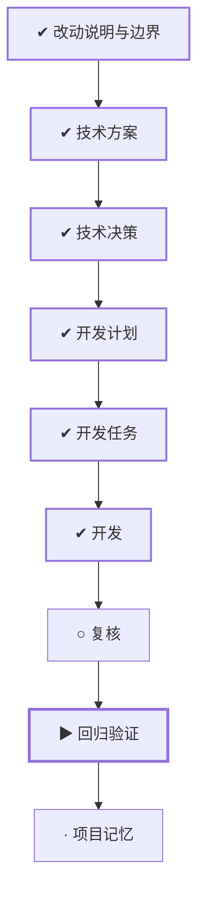

# WORK-018：解除 Web 对设计系统文档目录的依赖

<!--
本文件面向产品经理和不需要了解实现细节的读者。能用日常语言说清楚时不要使用专业词；必须使用时，
第一次出现就解释它对使用者意味着什么。字段、类、框架、协议、表名、路径和命令放到 DESIGN、PLAN
或 TASK。这里优先说明为什么做、完成后有什么变化、怎样算成功和可能影响谁。
-->

## 流程

<!-- 本节由 `scripts/work` 生成，请勿手工编辑；改动请运行 refresh。 -->

| 阶段 | 状态 | 必需性 | 依据文档 | 说明 |
|---|---|---|---|---|
| 改动说明与边界 | ✔ 完成 | 必需 | CHANGE-008 `approved` | 说清楚这件事要达成什么、边界在哪、怎样算完成 |
| 技术方案 | ✔ 完成 | 必需 | DESIGN-014 `approved` | 确定技术方案、边界与取舍 |
| 技术决策 | ✔ 完成 | 必需 | DECISION-013 `approved` |  |
| 开发计划 | ✔ 完成 | 必需 | PLAN-014 `approved` | 拆成阶段与顺序，说明并行、依赖、迁移与回退 |
| 开发任务 | ✔ 完成 | 必需 | TASK-026 `done` | 拆成可独立完成并验证的任务，划定可读、可写与禁止范围 |
| 开发 | ✔ 完成 | 必需 | TASK-026 `done` | 按任务实施，产出代码与测试 |
| 复核 | ○ 就绪 | 必需 | — | 独立复核实现是否符合定义与方案，边界有没有被越过 |
| 回归验证 | ▶ 进行中 | 必需 | VERIFY-018 `review` | 用可复现的证据确认要求逐条满足 |
| 项目记忆 | · 未开始 | 必需 | MEMORY-014 `draft` | 留下未来仍有参考价值的判断、教训与重审条件 |

## 待确认项

CHANGE-008、DESIGN-014、DECISION-013、PLAN-014 和 TASK-026 的实施授权均已确认。当前只等待用户人工
复核 VERIFY-018：确认“删除 `docs/design-system` 后前端不受影响”的自动证据满足本工作的验收意图。

## 变更记录

- 2026-08-28：创建工作项并生成初始流程。
- 2026-08-28：由 WORK-017 人工验收失败创建；完成跨目录依赖、校验能力、许可证和隔离验收边界审计，
  仅提交文档等待人工审核，尚未修改实现。
- 2026-08-28：根据文档、任务与验证事实刷新状态：todo → ready。
- 2026-08-28：根据文档、任务与验证事实刷新状态：ready → doing。
- 2026-08-28：根据文档、任务与验证事实刷新状态：doing → implemented。
- 2026-09-01：正文收敛为控制面入口，「为什么做、成功标准、当前流程、风险点、影响面、关联文档」不再在此重复；产品面内容以定义层文档为准。
- 2026-09-01：移除流程阶段：release、observe。MVP 阶段没有生产环境，这两个阶段永远无法完成。
