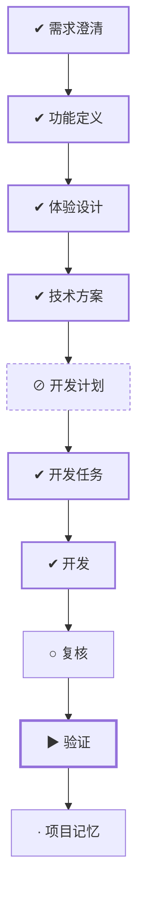

# WORK-019：设计 Cherry OJ 任务入口主页

## 流程

<!-- 本节由 `scripts/work` 生成，请勿手工编辑；改动请运行 refresh。 -->

| 阶段 | 状态 | 必需性 | 依据文档 | 说明 |
|---|---|---|---|---|
| 需求澄清 | ✔ 完成 | 必需 | WORK-019 `implemented` | 把还没想清楚的问题问出来并得到答复，否则不开工 |
| 功能定义 | ✔ 完成 | 必需 | FEATURE-002 `approved` | 说清楚这件事要达成什么、边界在哪、怎样算完成 |
| 体验设计 | ✔ 完成 | 必需 | EXPERIENCE-008 `approved` | 设计使用者实际看到和操作的流程，包含异常与失败状态 |
| 技术方案 | ✔ 完成 | 可选 | DESIGN-015 `approved` | 确定技术方案、边界与取舍 |
| 开发计划 | ⊘ 跳过 | 可选 | — | 拆成阶段与顺序，说明并行、依赖、迁移与回退 |
| 开发任务 | ✔ 完成 | 必需 | TASK-027 `done` | 拆成可独立完成并验证的任务，划定可读、可写与禁止范围 |
| 开发 | ✔ 完成 | 必需 | TASK-027 `done` | 按任务实施，产出代码与测试 |
| 复核 | ○ 就绪 | 必需 | — | 独立复核实现是否符合定义与方案，边界有没有被越过 |
| 验证 | ▶ 进行中 | 必需 | VERIFY-019 `review` | 用可复现的证据确认要求逐条满足 |
| 项目记忆 | · 未开始 | 必需 | MEMORY-015 `draft` | 留下未来仍有参考价值的判断、教训与重审条件 |

## 待确认项

- 请人工复核已交付的主页主 Frame、访客/白色/移动端 Frame 与状态矩阵是否满足产品意图；机器检查和
  执行侧视觉检查已通过，但不替代交付验收。
- 本次只交付 Figma 设计；若之后需要落地到 Web，必须另建或补充独立实施 TASK。

## 变更记录

- 2026-08-28：创建工作项并生成初始流程。
- 2026-08-28：用户批准文档并允许执行 TASK-027，工作进入 doing。
- 2026-08-28：用户明确批准 Starter plan 降级：Cherry Black / Pure White 使用两个独立单 mode semantic
  collection，局部组件用 Theme 变体保持同一 anatomy。
- 2026-08-28：TASK-027 完成；Figma Draft、4 个变量集合、207 个变量、6 个组件集/34 个变体、5 个交付
  Frame 与 60 个实例通过机器检查和逐 Frame 视觉检查，工作进入 implemented 并等待人工复核。
- 2026-09-01：正文收敛为控制面入口，「为什么做、成功标准、当前流程、风险点、影响面、关联文档」不再在此重复；产品面内容以定义层文档为准。
- 2026-09-01：移除流程阶段：release、observe。MVP 阶段没有生产环境，这两个阶段永远无法完成。
