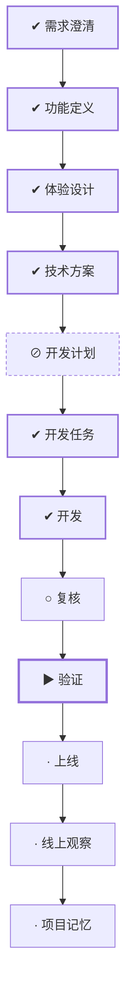

# WORK-020：搭建用户端与管理端应用布局

<!--
本文件面向产品经理和不需要了解实现细节的读者。能用日常语言说清楚时不要使用专业词；必须使用时，
第一次出现就解释它对使用者意味着什么。字段、类、框架、协议、表名、路径和命令放到 DESIGN、PLAN
或 TASK。这里优先说明为什么做、完成后有什么变化、怎样算成功和可能影响谁。
-->

## 流程

<!-- 本节由 `scripts/work` 生成，请勿手工编辑；改动请运行 refresh。 -->

| 阶段 | 状态 | 必需性 | 依据文档 | 说明 |
|---|---|---|---|---|
| 需求澄清 | ✔ 完成 | 必需 | WORK-020 `implemented` | 把还没想清楚的问题问出来并得到答复，否则不开工 |
| 功能定义 | ✔ 完成 | 必需 | FEATURE-003 `approved` | 说清楚这件事要达成什么、边界在哪、怎样算完成 |
| 体验设计 | ✔ 完成 | 必需 | EXPERIENCE-009 `approved` | 设计使用者实际看到和操作的流程，包含异常与失败状态 |
| 技术方案 | ✔ 完成 | 可选 | DESIGN-016 `approved` | 确定技术方案、边界与取舍 |
| 开发计划 | ⊘ 跳过 | 可选 | — | 拆成阶段与顺序，说明并行、依赖、迁移与回退 |
| 开发任务 | ✔ 完成 | 必需 | TASK-028 `done` | 拆成可独立完成并验证的任务，划定可读、可写与禁止范围 |
| 开发 | ✔ 完成 | 必需 | TASK-028 `done` | 按任务实施，产出代码与测试 |
| 复核 | ○ 就绪 | 必需 | — | 独立复核实现是否符合定义与方案，边界有没有被越过 |
| 验证 | ▶ 进行中 | 必需 | VERIFY-020 `review` | 用可复现的证据确认要求逐条满足 |
| 上线 | · 未开始 | 必需 | — | 把成果交付出去 |
| 线上观察 | · 未开始 | 必需 | — | 交付后观察实际结果，确认没有引入新问题 |
| 项目记忆 | · 未开始 | 必需 | MEMORY-016 `draft` | 留下未来仍有参考价值的判断、教训与重审条件 |

## 待确认项

当前没有阻塞性产品未知。需要人工审核 FEATURE-003、EXPERIENCE-009、DESIGN-016 与 TASK-028，并在
后续消息中明确允许执行；本轮只完成文档，不修改 Web 实现。

## 变更记录

- 2026-08-28：创建工作项并生成初始流程。
- 2026-08-28：完成双端壳层范围、响应式、设计系统、路由迁移与验证草案，提交人工审核。
- 2026-08-28：用户补充管理端 Dashboard 入口，并明确文档修改后允许直接执行 TASK-028。
- 2026-08-28：根据文档、任务与验证事实刷新状态：todo → doing。
- 2026-08-28：根据文档、任务与验证事实刷新状态：doing → implemented。
- 2026-08-28：人工复核提出 Footer 产品调整，后续定义与实施转入 WORK-022，保留本工作作为原始实现记录。
- 2026-09-01：正文收敛为控制面入口，「为什么做、成功标准、当前流程、风险点、影响面、关联文档」不再在此重复；产品面内容以定义层文档为准。
