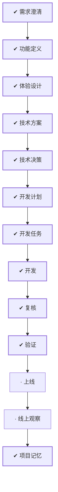

# WORK-025：交付题库、题目与测试数据管理

<!--
本文件面向产品经理和不需要了解实现细节的读者。能用日常语言说清楚时不要使用专业词；必须使用时，
第一次出现就解释它对使用者意味着什么。字段、类、框架、协议、表名、路径和命令放到 DESIGN、PLAN
或 TASK。这里优先说明为什么做、完成后有什么变化、怎样算成功和可能影响谁。
-->

## 流程

<!-- 本节由 `scripts/work` 生成，请勿手工编辑；改动请运行 refresh。 -->

| 阶段 | 状态 | 必需性 | 依据文档 | 说明 |
|---|---|---|---|---|
| 需求澄清 | ✔ 完成 | 必需 | WORK-025 `todo` | 把还没想清楚的问题问出来并得到答复，否则不开工 |
| 功能定义 | ✔ 完成 | 必需 | FEATURE-007 `approved`、ISSUE-005 `approved` | 说清楚这件事要达成什么、边界在哪、怎样算完成 |
| 体验设计 | ✔ 完成 | 必需 | EXPERIENCE-013 `approved` | 设计使用者实际看到和操作的流程，包含异常与失败状态 |
| 技术方案 | ✔ 完成 | 必需 | DESIGN-019 `approved` | 确定技术方案、边界与取舍 |
| 技术决策 | ✔ 完成 | 必需 | DECISION-014 `approved` |  |
| 开发计划 | ✔ 完成 | 必需 | PLAN-015 `approved` | 拆成阶段与顺序，说明并行、依赖、迁移与回退 |
| 开发任务 | ✔ 完成 | 必需 | TASK-033 `done`、TASK-034 `done`、TASK-035 `done`、TASK-036 `done`、TASK-037 `done`、TASK-038 `done`、TASK-039 `done`、TASK-040 `done`、TASK-042 `done` | 拆成可独立完成并验证的任务，划定可读、可写与禁止范围 |
| 开发 | ✔ 完成 | 必需 | TASK-033 `done`、TASK-034 `done`、TASK-035 `done`、TASK-036 `done`、TASK-037 `done`、TASK-038 `done`、TASK-039 `done`、TASK-040 `done`、TASK-042 `done` | 按任务实施，产出代码与测试 |
| 复核 | ✔ 完成 | 必需 | — | 独立复核实现是否符合定义与方案，边界有没有被越过 |
| 验证 | ✔ 完成 | 必需 | VERIFY-025 `approved`、VERIFY-027 `approved` | 用可复现的证据确认要求逐条满足 |
| 上线 | · 未开始 | 必需 | — | 把成果交付出去 |
| 线上观察 | · 未开始 | 必需 | — | 交付后观察实际结果，确认没有引入新问题 |
| 项目记忆 | ✔ 完成 | 必需 | MEMORY-020 `approved` | 留下未来仍有参考价值的判断、教训与重审条件 |

## 待确认项

负责人已确认 `DECISION-014` 中三个关键边界：匿名公开读取仍经 Gateway；测试数据首版存入配置的私有
文件存储并以不可变版本管理；题目管理首版只创建 C++ ACM，发布只面向当前 ACTIVE 判题环境，环境注册/
切换仍属于运维和后续管理范围。

## 变更记录

- 2026-08-30：创建工作项并生成初始流程。
- 2026-08-30：按公开题库列表与详情的独立纵向切片补全范围、风险、方案与实施任务，提交人工审核。
- 2026-08-30：根据负责人反馈扩展为题库、题目管理和测试数据管理一体化切片，增加部署、限制、验证与
  发布边界，重新提交审核。
- 2026-08-30：根据 WORK Type、风险、影响面和关注项重建流程。
- 2026-08-30：负责人批准文档并允许实施。
- 2026-08-31：题目管理默认列表出现 500；根据 request ID 确认为 Web `ALL` 筛选值越过
  API 边界并触发 Gateway 未映射的方法参数校验异常，新增 ISSUE-005、TASK-042 和
  VERIFY-027 提交审核。
- 2026-09-01：正文收敛为控制面入口，「为什么做、成功标准、当前流程、风险点、影响面、关联文档」不再在此重复；产品面内容以定义层文档为准。
