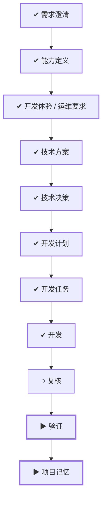

# WORK-026：为 Java 服务提供可直接启动的本地默认配置

<!--
本文件面向产品经理和不需要了解实现细节的读者。能用日常语言说清楚时不要使用专业词；必须使用时，
第一次出现就解释它对使用者意味着什么。字段、类、框架、协议、表名、路径和命令放到 DESIGN、PLAN
或 TASK。这里优先说明为什么做、完成后有什么变化、怎样算成功和可能影响谁。
-->

## 流程

<!-- 本节由 `scripts/work` 生成，请勿手工编辑；改动请运行 refresh。 -->

| 阶段 | 状态 | 必需性 | 依据文档 | 说明 |
|---|---|---|---|---|
| 需求澄清 | ✔ 完成 | 必需 | WORK-026 `todo` | 把还没想清楚的问题问出来并得到答复，否则不开工 |
| 能力定义 | ✔ 完成 | 必需 | CAPABILITY-007 `approved` | 说清楚这件事要达成什么、边界在哪、怎样算完成 |
| 开发体验 / 运维要求 | ✔ 完成 | 必需 | EXPERIENCE-014 `approved` | 设计使用者实际看到和操作的流程，包含异常与失败状态 |
| 技术方案 | ✔ 完成 | 必需 | DESIGN-020 `approved` | 确定技术方案、边界与取舍 |
| 技术决策 | ✔ 完成 | 必需 | DECISION-015 `approved` |  |
| 开发计划 | ✔ 完成 | 必需 | PLAN-016 `approved` | 拆成阶段与顺序，说明并行、依赖、迁移与回退 |
| 开发任务 | ✔ 完成 | 必需 | TASK-041 `done` | 拆成可独立完成并验证的任务，划定可读、可写与禁止范围 |
| 开发 | ✔ 完成 | 必需 | TASK-041 `done` | 按任务实施，产出代码与测试 |
| 复核 | ○ 就绪 | 必需 | — | 独立复核实现是否符合定义与方案，边界有没有被越过 |
| 验证 | ▶ 进行中 | 必需 | VERIFY-026 `review` | 用可复现的证据确认要求逐条满足 |
| 项目记忆 | ▶ 进行中 | 必需 | MEMORY-021 `review` | 留下未来仍有参考价值的判断、教训与重审条件 |

## 待确认项

2026-08-31 负责人已确认 DESIGN-020 / DECISION-015，并明确允许实施。本地随机 RSA、生产稳定 PEM、
数据库最小权限账号默认和有效空值保留均已实现；生产发布仍需目标环境授权与 Secret 注入。

## 变更记录

- 2026-08-31：创建工作项并生成初始流程。
- 2026-08-31：完成五个服务配置盘点，区分启动必需项、有效空值与 Spring 运行时属性，形成零 export
  本地启动且生产继续 fail-closed 的方案草案，等待负责人审核。
- 2026-08-31：负责人明确“WORK-026 文档通过，允许实施”，完成配置、随机密钥、生产守卫、跨服务
  扫描、启动说明和聚合验证；本机 judging 数据库服务账号尚未创建/授权，不属于配置缺省。
- 2026-08-31：根据 WORK Type、风险、影响面和关注项重建流程。
- 2026-08-31：流程阶段 复核：ready → doing。原因：开始复核配置语义、生产边界、WORK-025 差异和敏感信息
- 2026-08-31：流程阶段 复核：doing → done。原因：复核确认默认仅用于本地、production fail-closed、无固定私钥且未覆盖 WORK-025 实现
- 2026-08-31：运行时联调发现三个资源服务的本地 JWKS 默认地址与 user-service 实际发布地址不一致；
  已在原批准范围内修正、增加跨服务回归，并重新完成七模块聚合验证。
- 2026-09-01：正文收敛为控制面入口，「为什么做、成功标准、当前流程、风险点、影响面、关联文档」不再在此重复；产品面内容以定义层文档为准。
- 2026-09-01：移除流程阶段：release、observe。MVP 阶段没有生产环境，这两个阶段永远无法完成。
